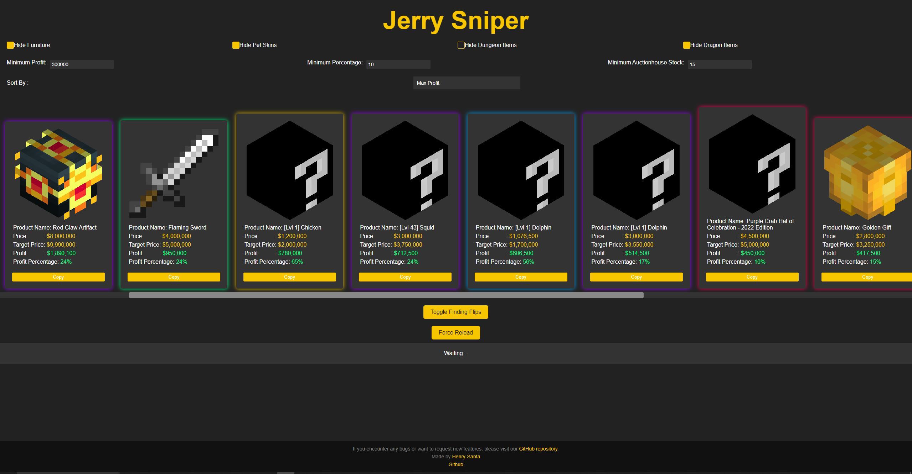

# Jerry Sniper

Jerry Sniper is a powerful tool for managing and optimizing your online marketplace listings. It helps you track prices, set target prices, calculate profits, and more, enabling you to make informed decisions and maximize your earnings.

## Features

- **Widget-based Interface:** Jerry Sniper provides a user-friendly widget-based interface that allows you to easily input and manage your flips.

- **Price and Profit Tracking:** You can view the price and profit of each flip along with the profit percent calculated after tax.

- **Dark Theme:** Jerry Sniper features a sleek and visually appealing dark theme, providing a comfortable viewing experience.

- **Horizontal Scroll Bar:** The widgets are arranged in a horizontal scroll bar, allowing you to navigate through your flips effortlessly.

- **Copy Button:** Each widget includes a copy button that allows you to quickly copy the viewauction command in hypixel to buy the flip fast!

- **Toggle Button:** You can toggle if the sniper is on or off at anytime with the toggle button/

- **Settings Section:** The settings section allows you to customize the display, such as hiding specific item categories or setting minimum profit thresholds.

- **Bug Reports/Feature Reccomendations:** You can report bugs or request new features by visiting our GitHub page. We value your feedback and continuously strive to improve Jerry Sniper.

## Screenshots

## Usage

1. Open the Jerry Sniper application.
2. Enter desired settings, and force reset when you are happy with them, to test them!
3. Use the copy button to copy the desired viewauction command for each flip.
4. Monitor the price, profit, and other details of your flips using the widget-based interface.
5. Enable or disable the main sniper using the toggle button.
6. Visit our GitHub page to report any issues, bugs, or feature requests.

## Installation

1. None needed
2. Just visit the site [Jerry Sniper](https://henry-santa.github.io/Jerry-Sniper/)
3. Enjoy!

## Contributing

Contributions to Jerry Sniper are welcome! If you have any ideas, bug reports, or feature requests, please open an issue on our [GitHub repository](https://github.com/henry-santa/Jerry-Sniper) or submit a pull request.

You can also contribute by giving our [GitHub repository](https://github.com/henry-santa/Jerry-Sniper) a star or watching to help this website grow.
## License

This project is licensed under the [MIT License](LICENSE).

